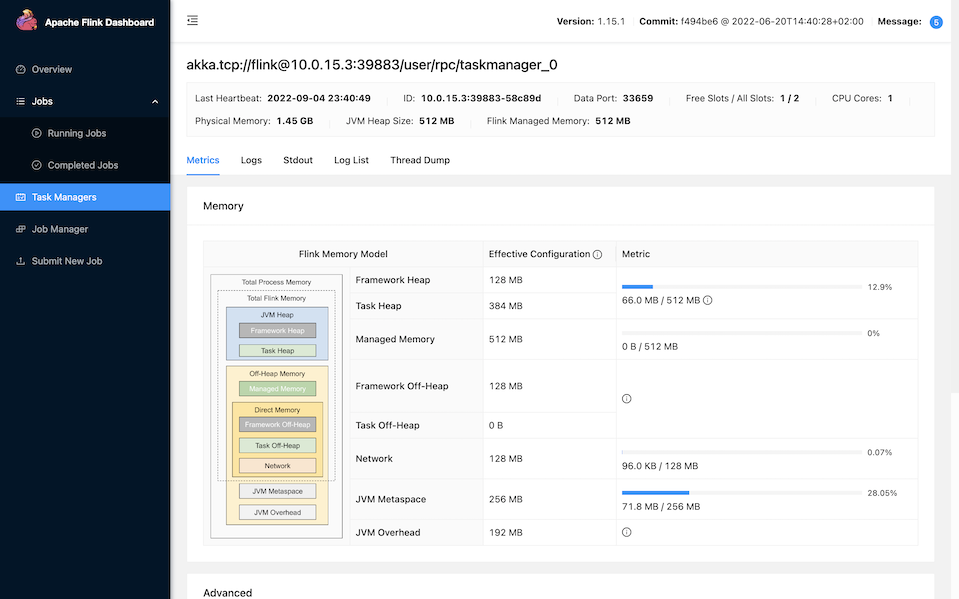
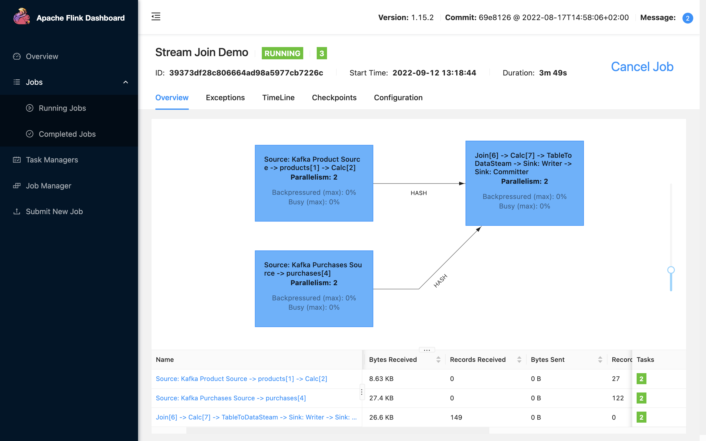

# Apache Flink / Apache Kafka Streaming Analytics Demo

[Apache Flink](https://flink.apache.org/) streaming data analytics demonstration, written in Java and
using the [Streaming Synthetic Sales Data Generator](https://github.com/garystafford/streaming-sales-generator). 

* `org.example.RunningTotals`: Consumes a stream of sales transaction messages and publishes a stream of running totals of product transactions, quantities, and sales to a Kafka topic
* `org.example.JoinStreams`: Consumes a stream of product and purchase messages from two different Kafka topics, joins both into an enriched purchase object, and writes results to a third Kafka topic

* Demonstration uses
  Kafka/Flink [Docker Swarm Stack](https://github.com/garystafford/streaming-sales-generator/blob/main/docker-compose.yml)
  from 'Sales Data Generator' project

* Uber JAR built with Gradle using Amazon Corretto (OpenJDK) version 11 (openjdk version "11.0.16.1" 2022-08-12 LTS)

## Video Demonstration

Short [YouTube video](https://youtu.be/ja0M_2zdbfs) demonstration of this project (video only - no audio).

## Input Message Stream

Sample sales purchase messages:

```txt
{"transaction_time": "2022-09-13 12:58:33.442579", "transaction_id": "1102438156100296597", "product_id": "SC02", "price": 5.99, "quantity": 2, "is_member": false, "member_discount": 0.0, "add_supplements": false, "supplement_price": 0.0, "total_purchase": 11.98}
{"transaction_time": "2022-09-13 12:58:33.442579", "transaction_id": "1102438156100296597", "product_id": "SF05", "price": 5.99, "quantity": 2, "is_member": false, "member_discount": 0.0, "add_supplements": false, "supplement_price": 0.0, "total_purchase": 11.98}
{"transaction_time": "2022-09-13 12:58:36.915834", "transaction_id": "2883033696701592101", "product_id": "SC04", "price": 5.99, "quantity": 1, "is_member": false, "member_discount": 0.0, "add_supplements": false, "supplement_price": 0.0, "total_purchase": 5.99}
{"transaction_time": "2022-09-13 12:58:36.915834", "transaction_id": "2883033696701592101", "product_id": "CS01", "price": 4.99, "quantity": 1, "is_member": false, "member_discount": 0.0, "add_supplements": false, "supplement_price": 0.0, "total_purchase": 4.99}
{"transaction_time": "2022-09-13 12:58:36.915834", "transaction_id": "2883033696701592101", "product_id": "CS09", "price": 4.99, "quantity": 1, "is_member": false, "member_discount": 0.0, "add_supplements": false, "supplement_price": 0.0, "total_purchase": 4.99}
{"transaction_time": "2022-09-13 12:58:40.144183", "transaction_id": "3818951251710853699", "product_id": "IS03", "price": 5.49, "quantity": 1, "is_member": false, "member_discount": 0.0, "add_supplements": false, "supplement_price": 0.0, "total_purchase": 5.49}
{"transaction_time": "2022-09-13 12:58:43.378102", "transaction_id": "8423291927238665701", "product_id": "SC04", "price": 5.99, "quantity": 1, "is_member": false, "member_discount": 0.0, "add_supplements": false, "supplement_price": 0.0, "total_purchase": 5.99}
{"transaction_time": "2022-09-13 12:58:49.438818", "transaction_id": "7801537351341225872", "product_id": "SF06", "price": 5.99, "quantity": 2, "is_member": false, "member_discount": 0.0, "add_supplements": false, "supplement_price": 0.0, "total_purchase": 11.98}
{"transaction_time": "2022-09-13 12:58:50.696241", "transaction_id": "5463447061814429579", "product_id": "SF07", "price": 5.99, "quantity": 1, "is_member": true, "member_discount": 0.1, "add_supplements": true, "supplement_price": 1.99, "total_purchase": 7.18}
{"transaction_time": "2022-09-13 12:58:51.933601", "transaction_id": "1037974254425034387", "product_id": "IS02", "price": 5.49, "quantity": 2, "is_member": true, "member_discount": 0.1, "add_supplements": false, "supplement_price": 0.0, "total_purchase": 9.88}
```

## Output Message Stream

Sample running totals messages:

```txt
{"event_time":"2022-09-10T02:43:58.320625Z","product_id":"SC01","transactions":35,"quantities":47,"sales":316.90}
{"event_time":"2022-09-10T02:43:59.528838Z","product_id":"CS10","transactions":23,"quantities":30,"sales":168.78}
{"event_time":"2022-09-10T02:44:02.755865Z","product_id":"CS08","transactions":64,"quantities":70,"sales":358.79}
{"event_time":"2022-09-10T02:44:03.962799Z","product_id":"SC04","transactions":52,"quantities":65,"sales":432.06}
{"event_time":"2022-09-10T02:44:05.150230Z","product_id":"CS04","transactions":22,"quantities":27,"sales":135.70}
{"event_time":"2022-09-10T02:44:06.458681Z","product_id":"SF05","transactions":36,"quantities":44,"sales":301.12}
{"event_time":"2022-09-10T02:44:08.668936Z","product_id":"CS10","transactions":24,"quantities":31,"sales":173.77}
{"event_time":"2022-09-10T02:44:11.889087Z","product_id":"SF03","transactions":22,"quantities":26,"sales":175.42}
{"event_time":"2022-09-10T02:44:15.003075Z","product_id":"CS08","transactions":65,"quantities":71,"sales":365.07}
{"event_time":"2022-09-10T02:44:16.209181Z","product_id":"SF07","transactions":51,"quantities":62,"sales":426.45}
```

Sample enriched purchases messages:

```txt
{"transaction_time":"2022-09-13 12:50:55.644564","transaction_id":"1142152017802750696","product_id":"CS06","product_category":"Classic Smoothies","product_name":"Blimey Limey","product_size":"24 oz.","product_cogs":1.50,"product_price":4.99,"contains_fruit":true,"contains_veggies":false,"contains_nuts":false,"contains_caffeine":false,"purchase_price":4.99,"purchase_quantity":1,"is_member":false,"member_discount":0.00,"add_supplements":false,"supplement_price":0.00,"total_purchase":4.99}
{"transaction_time":"2022-09-13 12:50:57.889523","transaction_id":"5186286335839079216","product_id":"SF06","product_category":"Superfoods Smoothies","product_name":"Get Up and Goji","product_size":"24 oz.","product_cogs":2.10,"product_price":5.99,"contains_fruit":true,"contains_veggies":true,"contains_nuts":false,"contains_caffeine":false,"purchase_price":5.99,"purchase_quantity":1,"is_member":true,"member_discount":0.10,"add_supplements":false,"supplement_price":0.00,"total_purchase":5.39}
{"transaction_time":"2022-09-13 12:50:59.153677","transaction_id":"3488041191398632204","product_id":"SF04","product_category":"Superfoods Smoothies","product_name":"Pomegranate Plunge","product_size":"24 oz.","product_cogs":2.10,"product_price":5.99,"contains_fruit":true,"contains_veggies":false,"contains_nuts":false,"contains_caffeine":false,"purchase_price":5.99,"purchase_quantity":1,"is_member":false,"member_discount":0.00,"add_supplements":false,"supplement_price":0.00,"total_purchase":5.99}
{"transaction_time":"2022-09-13 12:51:01.387870","transaction_id":"77267280375192969","product_id":"CS03","product_category":"Classic Smoothies","product_name":"Paradise Point","product_size":"24 oz.","product_cogs":1.50,"product_price":4.99,"contains_fruit":true,"contains_veggies":false,"contains_nuts":false,"contains_caffeine":false,"purchase_price":4.99,"purchase_quantity":2,"is_member":false,"member_discount":0.00,"add_supplements":false,"supplement_price":0.00,"total_purchase":9.98}
{"transaction_time":"2022-09-13 12:51:01.387870","transaction_id":"77267280375192969","product_id":"SC03","product_category":"Supercharged Smoothies","product_name":"Health Nut","product_size":"24 oz.","product_cogs":2.70,"product_price":5.99,"contains_fruit":false,"contains_veggies":false,"contains_nuts":true,"contains_caffeine":false,"purchase_price":5.99,"purchase_quantity":1,"is_member":false,"member_discount":0.00,"add_supplements":false,"supplement_price":0.00,"total_purchase":5.99}
{"transaction_time":"2022-09-13 12:51:01.387870","transaction_id":"77267280375192969","product_id":"IS04","product_category":"Indulgent Smoothies","product_name":"Mocha Madness","product_size":"24 oz.","product_cogs":2.20,"product_price":5.49,"contains_fruit":false,"contains_veggies":false,"contains_nuts":true,"contains_caffeine":true,"purchase_price":5.49,"purchase_quantity":1,"is_member":false,"member_discount":0.00,"add_supplements":false,"supplement_price":0.00,"total_purchase":5.49}
{"transaction_time":"2022-09-13 12:51:03.072536","transaction_id":"5904837887652070959","product_id":"IS01","product_category":"Indulgent Smoothies","product_name":"Bahama Mama","product_size":"24 oz.","product_cogs":2.20,"product_price":5.49,"contains_fruit":true,"contains_veggies":false,"contains_nuts":false,"contains_caffeine":false,"purchase_price":5.49,"purchase_quantity":1,"is_member":false,"member_discount":0.00,"add_supplements":false,"supplement_price":0.00,"total_purchase":5.49}
{"transaction_time":"2022-09-13 12:51:06.370331","transaction_id":"5479660984247512791","product_id":"SF06","product_category":"Superfoods Smoothies","product_name":"Get Up and Goji","product_size":"24 oz.","product_cogs":2.10,"product_price":5.99,"contains_fruit":true,"contains_veggies":true,"contains_nuts":false,"contains_caffeine":false,"purchase_price":5.99,"purchase_quantity":1,"is_member":false,"member_discount":0.00,"add_supplements":true,"supplement_price":1.99,"total_purchase":7.98}
{"transaction_time":"2022-09-13 12:51:09.807906","transaction_id":"8552032150877524327","product_id":"SF06","product_category":"Superfoods Smoothies","product_name":"Get Up and Goji","product_size":"24 oz.","product_cogs":2.10,"product_price":5.99,"contains_fruit":true,"contains_veggies":true,"contains_nuts":false,"contains_caffeine":false,"purchase_price":5.99,"purchase_quantity":3,"is_member":true,"member_discount":0.10,"add_supplements":false,"supplement_price":0.00,"total_purchase":16.17}
{"transaction_time":"2022-09-13 12:51:09.807906","transaction_id":"8552032150877524327","product_id":"SF05","product_category":"Superfoods Smoothies","product_name":"Caribbean C-Burst","product_size":"24 oz.","product_cogs":2.10,"product_price":5.99,"contains_fruit":true,"contains_veggies":false,"contains_nuts":false,"contains_caffeine":false,"purchase_price":5.99,"purchase_quantity":1,"is_member":true,"member_discount":0.10,"add_supplements":false,"supplement_price":0.00,"total_purchase":5.39}
```

## Apache Flink Dashboard Preview





## Compile and Run Flink Job

```shell
# optional - set java version
JAVA_HOME=~/Library/Java/JavaVirtualMachines/corretto-11.0.16.1/Contents/Home

# build uber jar using Gradle


# Upload via the Flink UI or copy to Flink Docker image
FLINK_CONTAINER=$(docker container ls --filter  name=kafka-flink_jobmanager --format "{{.ID}}")
docker cp build/libs/flink-kafka-demo-1.0.0-all.jar ${FLINK_CONTAINER}:/tmp
docker exec -it ${FLINK_CONTAINER} bash

flink run -c org.example.RunningTotals /tmp/flink-kafka-demo-1.0.0-all.jar

flink run -c org.example.JoinStreams /tmp/flink-kafka-demo-1.0.0-all.jar
```

## Kafka

Helpful Kafka commands.

```shell
docker exec -it $(docker container ls --filter  name=kafka-flink_kafka --format "{{.ID}}") bash

export BOOTSTRAP_SERVERS="localhost:9092"

export INPUT_TOPIC="demo.purchases"
export OUTPUT_TOPIC="demo.running.totals"

export PRODUCT_TOPIC="demo.products";
export PURCHASE_TOPIC="demo.purchases";
export PURCHASES_ENRICHED_TOPIC="demo.purchases.enriched";

# list all topics
kafka-topics.sh --list \
    --bootstrap-server $BOOTSTRAP_SERVERS

# describe topic
kafka-topics.sh --describe \
    --topic $OUTPUT_TOPIC \
    --bootstrap-server $BOOTSTRAP_SERVERS

# delete topic
kafka-topics.sh --delete \
    --topic $INPUT_TOPIC \
    --bootstrap-server $BOOTSTRAP_SERVERS

kafka-topics.sh --delete \
    --topic $OUTPUT_TOPIC \
    --bootstrap-server $BOOTSTRAP_SERVERS

# optional: create new topic (or they will be automatically created
kafka-topics.sh --create \
    --topic $INPUT_TOPIC \
    --partitions 1 --replication-factor 1 \
    --config cleanup.policy=compact \
    --bootstrap-server $BOOTSTRAP_SERVERS

kafka-topics.sh --create \
    --topic $OUTPUT_TOPIC \
    --partitions 1 --replication-factor 1 \
    --config cleanup.policy=compact \
    --bootstrap-server $BOOTSTRAP_SERVERS

# view messages
kafka-console-consumer.sh \
    --topic $INPUT_TOPIC --from-beginning \
    --bootstrap-server $BOOTSTRAP_SERVERS

kafka-console-consumer.sh \
    --topic $OUTPUT_TOPIC --from-beginning \
    --bootstrap-server $BOOTSTRAP_SERVERS
```

## Docker Stack

Demonstration uses
Kafka/Flink [Docker Swarm Stack](https://github.com/garystafford/streaming-sales-generator/blob/main/docker-compose.yml)
from 'Sales Data Generator' project.

See [bitnami/kafka](https://hub.docker.com/r/bitnami/kafka) on Docker Hub for more information about running Kafka
locally using Docker.

```shell
# optional: delete previous stack
docker stack rm kafka-flink

# deploy kafka stack
docker swarm init
docker stack deploy kafka-flink --compose-file docker-compose.yml

# optional: to exec into Kafka container
docker exec -it $(docker container ls --filter  name=kafka-flink_kafka --format "{{.ID}}") bash
```

### Containers

Example containers:

```text
CONTAINER ID   IMAGE                      PORTS                                    NAMES
69ad1556eb3a   flink:latest               6123/tcp, 8081/tcp                       kafka-flink_taskmanager.1...
9f9b8e43eb21   flink:latest               6123/tcp, 8081/tcp                       kafka-flink_jobmanager.1...
6114dc4a9824   bitnami/kafka:latest       9092/tcp                                 kafka-flink_kafka.1...
837c0cdd1498   bitnami/zookeeper:latest   2181/tcp, 2888/tcp, 3888/tcp, 8080/tcp   kafka-flink_zookeeper.1...
```

## References

* <https://www.baeldung.com/kafka-flink-data-pipeline>
* <https://github.com/eugenp/tutorials/tree/master/apache-kafka/src/main/java/com/baeldung/flink>
* <https://github.com/apache/flink/blob/master/flink-examples/flink-examples-table/src/main/java/org/apache/flink/table/examples/java/basics/StreamSQLExample.java>
---

_The contents of this repository represent my viewpoints and not of my past or current employers, including Amazon Web
Services (AWS). All third-party libraries, modules, plugins, and SDKs are the property of their respective owners. The
author(s) assumes no responsibility or liability for any errors or omissions in the content of this site. The
information contained in this site is provided on an "as is" basis with no guarantees of completeness, accuracy,
usefulness or timeliness._
